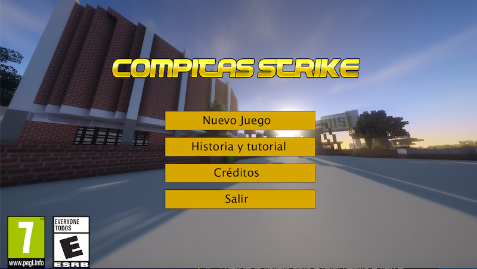
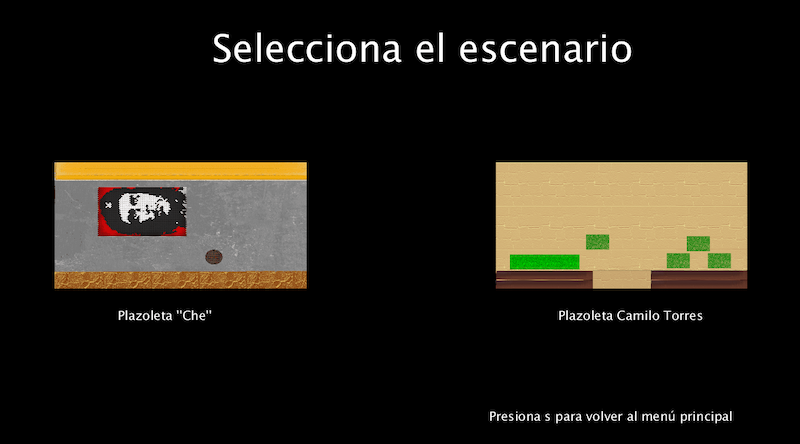

Compitas Strike
================

**Proyecto final para la asignatura Programación de computadores I**

Realizado por:

- Rafael Santiago Suárez Gil

- Daniel Augusto García

En un momento utópico en el que es permitido asistir a la Universidad Industrial de Santander de forma presencial, nuestro personaje deberá enfrentarse a los peligros de contagiarse de Covid-19 y de quedar "en bolsa" por un bajo promedio.

### Características

- El personaje (Diseño propiedad de la franquicia Pokémon) aparece inicialmente inmovil en el centro de la pantalla y se desplaza con las flechas del teclado.

- Deberá empezar a moverse para escapar de "el profesor" (Diseño propiedad de la franquicia Pokémon) que intentará acercarse irrespetando el distaciamiento social.

- El personaje también deberá estudiar para mantener bien su promedio, para esto el personaje deberá ubicarse sobre los líbros de la parte inferior izquierda de la pantalla.

- El juego cuenta con dos barras, las cuales el jugador debe procurar mantenerlas lo más llenas posible, ya que en caso de que la barra de "SALUD" llegue a 0, el personaje se contagiará de Covid-19 y en caso de que la barra de "ESTUDIO" no esté lo suficientemente llena, el personaje tendrá una mala nota, lo que hará que su promedio baje y probablemente quede "en bolsa" (promedio inferior a 3).

- Si el jugador queda "en bolsa" o se contagia de Covid-19 terminará la partida del jugador.

- Para aumentar la barra de vida el personaje puede comer "toxicombos" que aparecerán por toda la pantalla.

- El videojuego está ambientado en las instalaciones de la Universidad Industrial de Santander.

- Juego apto para personas mayores de 7 años ya que no presenta violencia, pero puede presentar situaciones o lenguaje dificiles de comprender.

